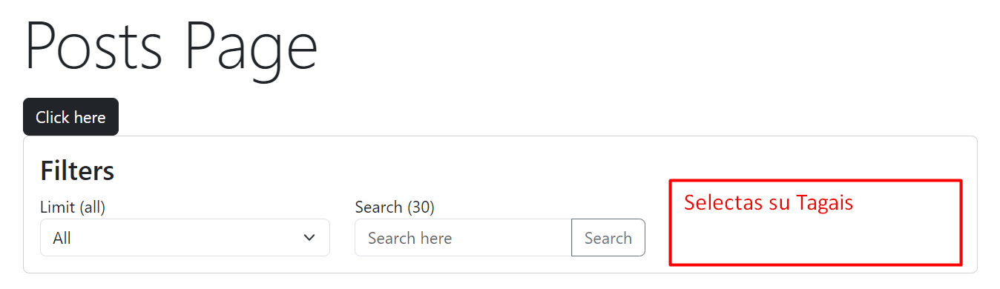

## add router

1. `yarn add react-router-dom`
2. main.tsx App apjuosti su BrowserRouter
3. App komponente kuriam Routes ir vidue Route componentus

# Praktika

1. sugeneruoti selecta 
2. padaryti kad veiktu (sunkesnis)

## pasirinkti kita resursa si Dummy posts pvz Recipes

1. RecipesList
2. RecipesPage
3. SingleRecipesPage
4. Filtravima pagal limit ar title
5. pasiziureti kaip filtuori su query parametrais ?limit=50
